# EASYFIT – Módulo Accesible de Ejercicios Guiados

## Descripción del proyecto

EASYFIT es un mini módulo funcional desarrollado como proyecto, el cual busca mejorar la accesibilidad tecnológica para adultos mayores mediante una aplicación sencilla e intuitiva orientada a rutinas de ejercicio guiadas desde casa.

La solución fue diseñada aplicando principios de experiencia de usuario (UX), accesibilidad, innovación incremental e interacción humano-computador (HCI), permitiendo que usuarios con baja experiencia tecnológica puedan realizar ejercicios de manera segura y guiada.


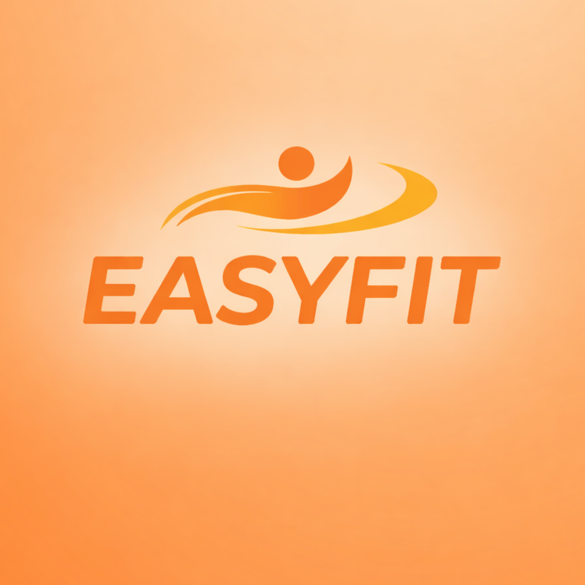

---

# Objetivo del mini módulo

Desarrollar un módulo funcional accesible que permita a adultos mayores realizar rutinas de ejercicio guiadas mediante una interfaz simple, intuitiva y adaptable, incorporando herramientas de accesibilidad y persistencia de información.

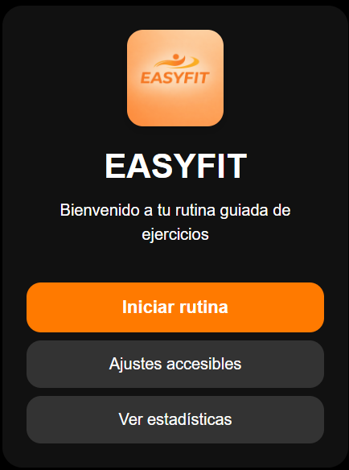

---

# Problemática identificada

Muchas aplicaciones de ejercicio presentan interfaces complejas, navegación confusa y exceso de funcionalidades que dificultan su uso por parte de adultos mayores.

Esto genera barreras tecnológicas que limitan el acceso a herramientas digitales enfocadas en salud y bienestar físico.

EASYFIT busca reducir dichas barreras mediante:

- Navegación lineal
- Botones grandes
- Instrucciones claras
- Soporte auditivo
- Ajustes de accesibilidad
- Diseño centrado en el usuario

---

# Tecnologías utilizadas

HTML5: Estructura del sistema        
CSS3: Diseño visual y accesibilidad 
JavaScript: Lógica funcional              
LocalStorage: Persistencia de datos         
SpeechSynthesis API: Instrucciones por voz         
GitHub: Control de versiones          
Visual Studio Code: Desarrollo                    

---

# Funcionalidades implementadas

## Funcionalidades principales

- Inicio de rutina guiada
- Navegación secuencial entre ejercicios
- Instrucciones por voz automáticas
- Temporizador de descanso
- Mensajes motivacionales
- Barra de progreso
- Persistencia del progreso
- Estadísticas básicas
- Pantalla final de rutina


---
## Funcionalidades de accesibilidad

- Ajuste de tamaño de letra
- Activación/desactivación de voz
- Modo alto contraste
- Diseño responsive
- Interfaz minimalista
- Botones grandes y visibles

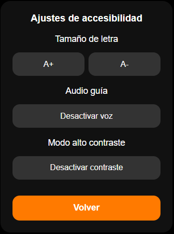


---

# Arquitectura del sistema

El sistema fue desarrollado bajo una arquitectura simple basada en componentes web estáticos.

## Estructura del proyecto

```bash
easyfit-modulo/
│
├── index.html
├── style.css
├── script.js
├── ejercicios.js
│
├── assets/ img/
│
├── evidencias/
│
└── README.md
```

---

# Aplicación de conceptos vistos en clase

## Semana 10 – Innovación abierta y ecosistemas tecnológicos

Durante el desarrollo del mini módulo EASYFIT se aplicaron conceptos de innovación abierta mediante el uso de tecnologías y herramientas externas integradas al sistema.

Uno de los principales ejemplos fue la implementación de la SpeechSynthesis API del navegador, utilizada para generar instrucciones auditivas automáticas durante las rutinas de ejercicio. Esta integración permitió aprovechar funcionalidades ya existentes dentro del ecosistema web sin necesidad de desarrollar un sistema de audio desde cero.

Además, el proyecto reutiliza tecnologías abiertas ampliamente utilizadas en desarrollo web como HTML5, CSS3 y JavaScript, aprovechando estándares accesibles y compatibles con múltiples dispositivos.

Desde el enfoque administrativo, también se evaluó la viabilidad de utilizar herramientas ligeras y gratuitas que permitieran reducir costos de implementación y facilitar el mantenimiento futuro del sistema.

### Conceptos aplicados

- Integración de APIs externas
- Reutilización de tecnologías abiertas
- Innovación incremental
- Ecosistemas tecnológicos
- Evaluación de herramientas tecnológicas
- Escalabilidad futura

### Aplicación en EASYFIT

- Uso de SpeechSynthesis API para apoyo auditivo
- Uso de LocalStorage para persistencia local
- Diseño modular preparado para futuras rutinas
- Arquitectura adaptable a futuras integraciones

---

## Semana 12 – Resolución creativa de problemas

El proyecto aplicó técnicas de resolución creativa de problemas para responder a las necesidades específicas de adultos mayores con baja experiencia tecnológica.

Inicialmente se identificó que muchas aplicaciones de ejercicio presentan menús complejos, exceso de información y procesos difíciles de comprender para el usuario objetivo. A partir de ello, se aplicó pensamiento lateral para replantear la interacción del sistema desde una perspectiva más simple y accesible.

En lugar de incorporar múltiples opciones y navegación compleja, se diseñó un flujo lineal paso a paso donde el usuario únicamente debe avanzar mediante botones claros y visibles.

También se aplicó pensamiento sistémico al analizar cómo pequeños cambios en accesibilidad podían impactar directamente la experiencia del usuario, por ejemplo:

- instrucciones por voz
- temporizador visual
- mensajes motivacionales
- modo alto contraste
- botones grandes

Además, se consideraron escenarios hipotéticos relacionados con dificultades visuales, pérdida de progreso o problemas de comprensión tecnológica, lo que llevó a implementar persistencia automática y herramientas de accesibilidad.

### Conceptos aplicados

- Pensamiento lateral
- Resolución creativa de problemas
- Pensamiento sistémico
- Escenarios hipotéticos
- Reducción de carga cognitiva
- Accesibilidad tecnológica

### Aplicación en EASYFIT

- Navegación lineal y simplificada
- Eliminación de menús complejos
- Persistencia automática mediante LocalStorage
- Temporizador de descanso
- Instrucciones auditivas automáticas
- Mensajes de acompañamiento al usuario

---

## Semana 13 – Innovación en UX y experiencia de usuario

La experiencia de usuario fue uno de los componentes centrales del desarrollo del proyecto.

EASYFIT fue diseñado específicamente para adultos mayores, por lo que todas las decisiones visuales y funcionales estuvieron orientadas a mejorar accesibilidad, comprensión e interacción.

Se aplicaron principios de diseño centrado en el usuario mediante:

- botones grandes y visibles
- textos legibles
- navegación intuitiva
- colores cálidos y contrastantes
- interfaces minimalistas
- retroalimentación constante

También se incorporaron funcionalidades adaptativas como:

- aumento y reducción del tamaño de letra
- modo alto contraste
- activación y desactivación de voz
- diseño responsive

Estas decisiones buscan reducir barreras tecnológicas y generar confianza durante el uso del sistema.

Además, durante el desarrollo se identificaron problemas de legibilidad en el modo alto contraste, los cuales fueron corregidos mediante ajustes dinámicos de color para garantizar accesibilidad visual adecuada.

### Conceptos aplicados

- UX centrado en usuario
- Diseño accesible
- Interacción humano-computador
- Accesibilidad visual
- Diseño responsive
- Retroalimentación visual y auditiva

### Aplicación en EASYFIT

- Pantalla de ajustes accesibles
- Contraste adaptable
- Interfaz minimalista
- Temporizador visual
- Barra de progreso
- Mensajes motivacionales
- Compatibilidad móvil

---

## Semana 14 – Propiedad intelectual, licencias y ética

El proyecto también consideró aspectos relacionados con el uso responsable de tecnologías y recursos digitales.

Durante el desarrollo se utilizaron tecnologías web estándar y APIs públicas integradas en el navegador respetando principios de accesibilidad y uso ético de herramientas digitales.

Asimismo, se tuvo en cuenta la importancia de desarrollar soluciones responsables orientadas al bienestar del usuario, especialmente considerando que el sistema está dirigido a adultos mayores.

Desde la perspectiva ética, el proyecto evita prácticas invasivas o complejas para el usuario, priorizando simplicidad, seguridad y claridad durante la interacción.

También se consideró la importancia de respetar licencias y recursos utilizados dentro del sistema, incluyendo imágenes, herramientas de desarrollo y tecnologías externas.

### Conceptos aplicados

- Uso ético de tecnologías
- Accesibilidad responsable
- Propiedad intelectual
- Licenciamiento tecnológico
- Responsabilidad social del software

### Aplicación en EASYFIT

- Uso de APIs públicas del navegador
- Diseño orientado al bienestar del usuario
- Interfaz segura y simple
- Uso responsable de herramientas digitales
- Desarrollo centrado en inclusión tecnológica

---

# Evidencias del funcionamiento

## Pantalla principal

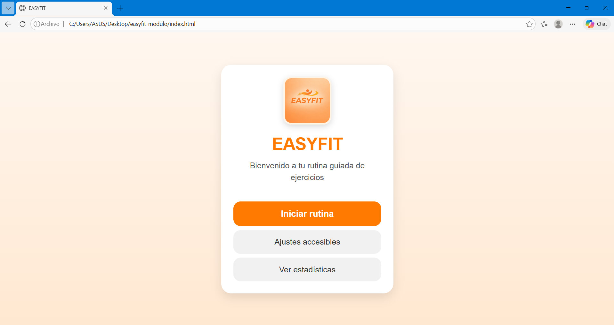

---

## Pantalla de ejercicios

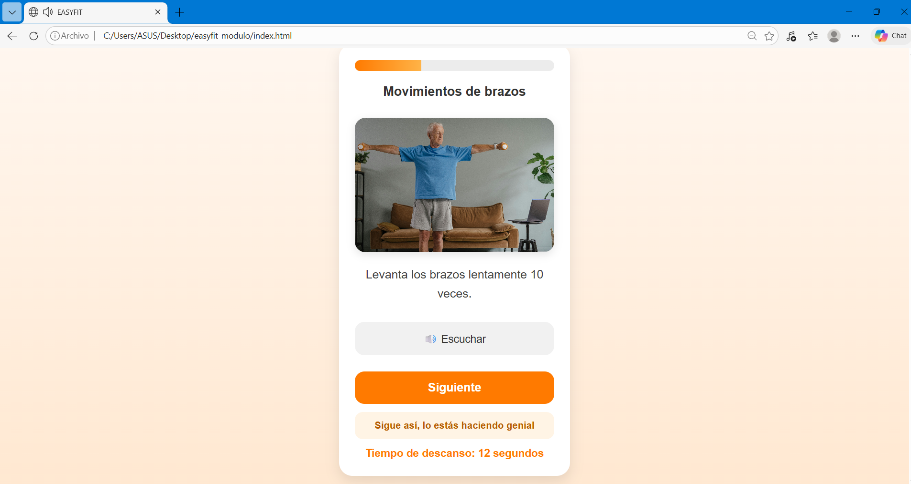

---

## Funcionalidad de audio

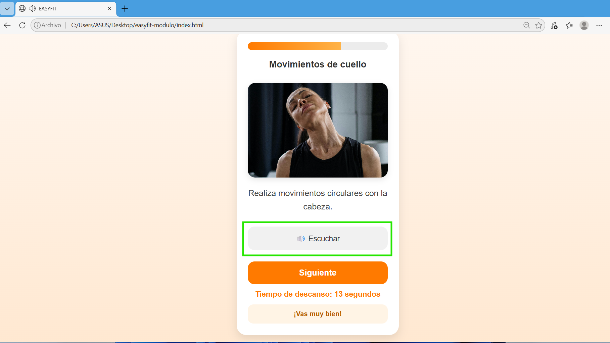

---

## Ajustes accesibles

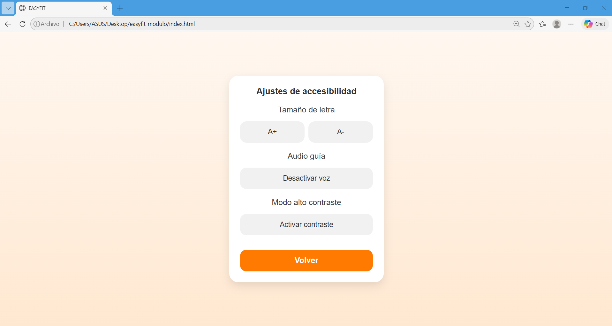

---

## Modo alto contraste

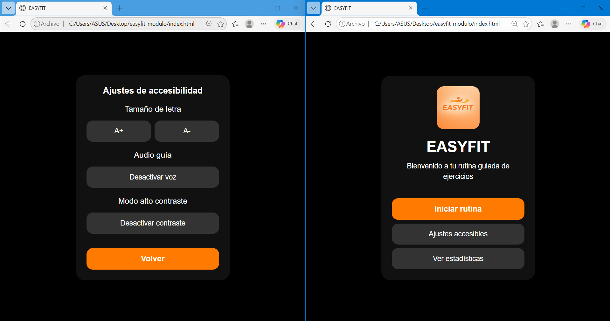

---

## Estadísticas del usuario

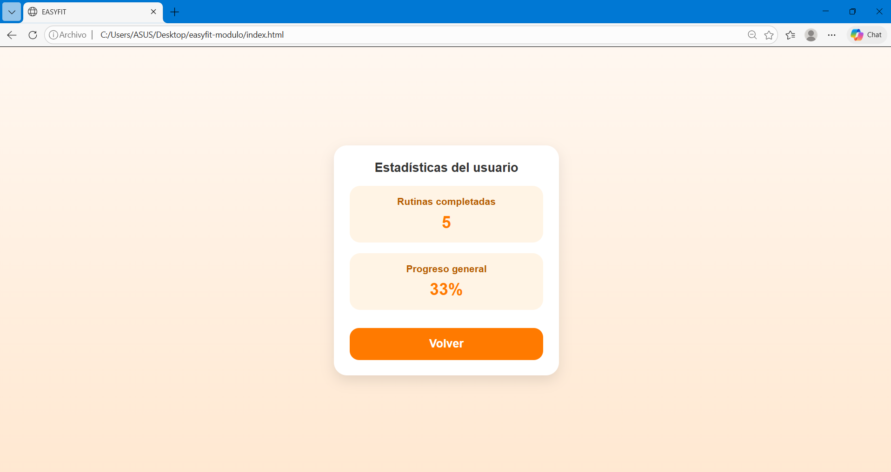

---

## Pantalla final

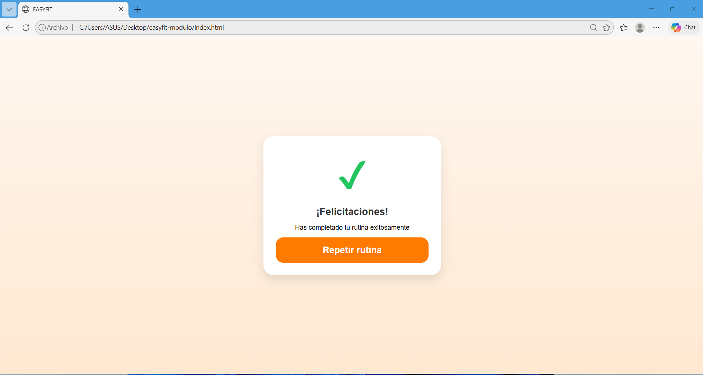

---

## Repositorio GitHub

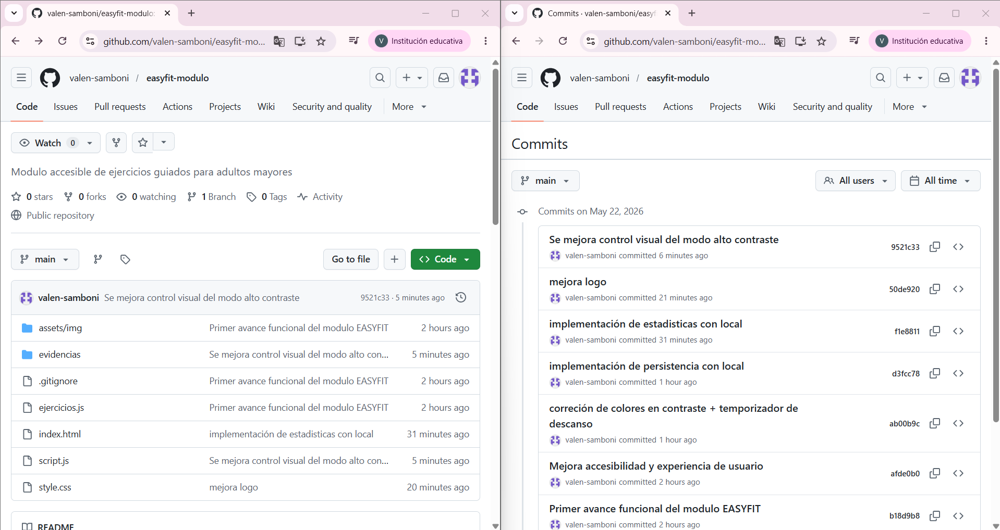

---

# Persistencia y almacenamiento

El sistema utiliza LocalStorage para conservar:

- Progreso de ejercicios
- Preferencias de accesibilidad
- Estado del modo contraste
- Configuración de voz
- Rutinas completadas

Esto permite mejorar la experiencia de usuario y evitar pérdida de información durante el uso.

---

# Viabilidad del proyecto

El módulo desarrollado es viable técnicamente debido a:

- Bajo consumo de recursos
- Facilidad de despliegue
- Compatibilidad web
- Arquitectura sencilla
- Escalabilidad futura

A futuro, EASYFIT podría incorporar:

- Nuevas rutinas
- Inteligencia artificial
- Seguimiento médico
- Recomendaciones personalizadas
- Base de datos real
- Aplicación móvil multiplataforma

---

# Reflexión final

EASYFIT permitió aplicar conocimientos técnicos y administrativos mediante el desarrollo de una solución funcional centrada en accesibilidad y experiencia de usuario.

El proyecto demuestra que la innovación en ingeniería de software no depende únicamente de tecnologías complejas, sino también de la capacidad de diseñar soluciones útiles, comprensibles e inclusivas para necesidades reales de los usuarios.

---

# Repositorio del proyecto

GitHub:
https://github.com/valen-samboni/easyfit-modulo
